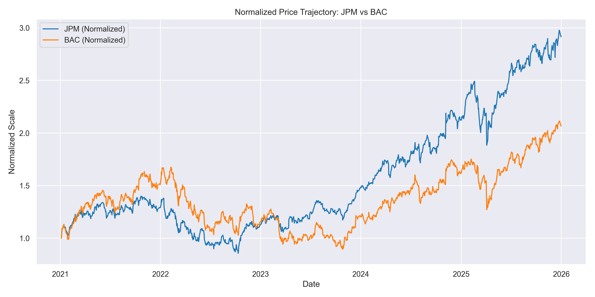
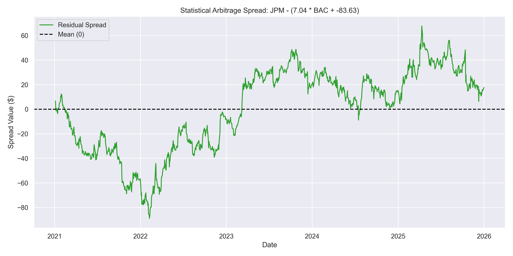
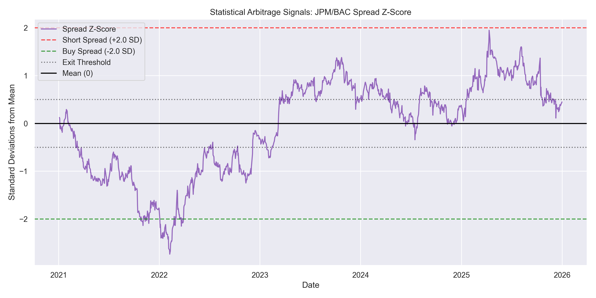
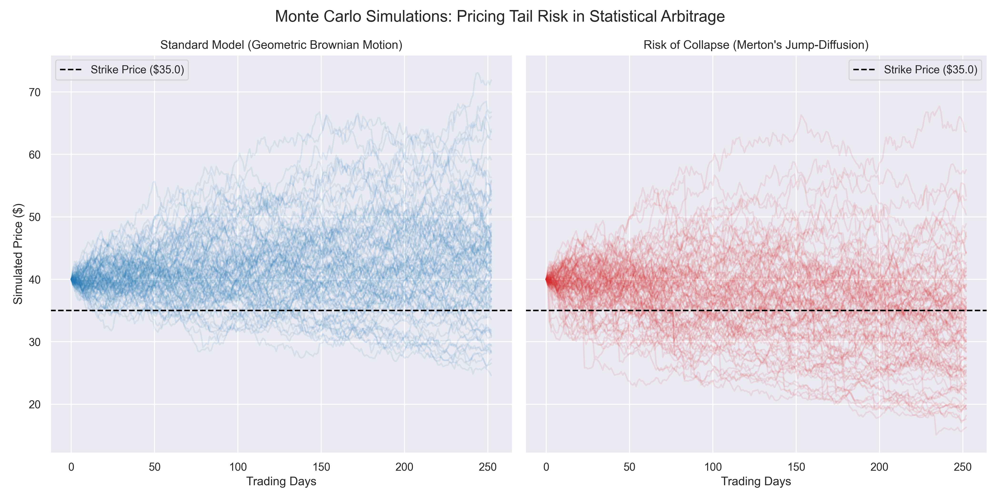

# Findings on Stochastic Processes and Linear Regression Implementations in Predictive Financial Models
**Testing the progression from financial deterministic mapping (MLR, VAR) to continuous stochastic modeling (OU, GBM, MJD) by computational simulations.**

**Author:** Alimert Demirel  

**Focus:** Quantitative Finance, Stochastic Calculus, High-Performance Computing in C++  

This repository contains a high performance quantitative research pipeline designed to model statistical arbitrage opportunities between highly correlated equities (JPM and BAC). It utilizes deterministic models (Linear Regression, Vector Autoregression) to identify neutral trading signals, and continuous-time stochastic models (Ornstein-Uhlenbeck) to define trade execution. 

Furthermore, the project features a custom built C++ Monte Carlo Engine to mathematically prove that standard volatility models (Geometric Brownian Motion) drastically underprice tail-risk when compared to Jump Diffusion environments.

--- JPMorgan Chase & Co. (JPM) and Bank of America Corp (BAC) will be used for sampling. ---

## Part I: Statistical Hedged Arbitrage and the Risk of Collapse  
The statistical arbitrage trading algorithm calculates the points of failure, and then mathematically prices the derivatives needed to survive that failure.

### -- Multiple Linear Regression (Spread Calibration)
Calculates the dynamic hedge ratio.  

The General OLS Equation:
$$\large Y_t = \alpha + \beta X_t + \epsilon_t$$  

The Spread calculation used:
$$\large \text{Spread}_t = \text{JPM}_t - (\beta \cdot \text{BAC}_t + \alpha)$$  

Where: $$\large \text{Spread}_t = \text{JPM}_t - (7.0422 \cdot \text{BAC}_t - 83.6336)$$

**Result:** Achieved an $R^2$ score of ~0.70, validating the strong cointegration of the chosen pair.  

<br>
  

### -- Ornstein-Uhlenbeck Process (The Trade Signals)
The spread between two assets could be mean-reverting, by fitting the OU process to the spread data, this continuous-time model gives better entry/exit thresholds.  

The isolated spread was modeled using the OU stochastic differential equation:
  $$\large dx_t = \theta (\mu - x_t) dt + \sigma dW_t$$    

  Where, the Half-Life Formula: $$\large t_{1/2} = \frac{\ln(2)}{\theta}$$
  
**Result:** Calculated a mean-reverting Half-Life of **0.82 days**, allowing for the generation of dynamic, high-frequency Z-score trading thresholds.  



### -- Vector Autoregression (Warning System)
The arbitrage collapses when the environment abruptly changes. This model tracks short term interdependencies between the asset pair's spread and macro indicators.  

**The Mathematics**
Unlike simple linear regression, VAR captures the linear interdependencies among multiple time series. The model analyzes the lagged relationships between the asset pair's residual spread and external macroeconomic indicators (such as the 10 Year Treasury Yield and financial sector volume). 

The VAR($p$) model is mathematically defined as:

$$\Large Y_t = c + A_1 Y_{t-1} + A_2 Y_{t-2} + \dots + A_p Y_{t-p} + \epsilon_t$$

* $Y_t$: A $k \times 1$ vector of endogenous variables at time $t$ (e.g., Spread, Interest Rates, Sector Volume).
* $c$: A $k \times 1$ vector of constants (intercepts).
* $A_i$: $k \times k$ time-invariant coefficient matrices containing the lagged effects.
* $\epsilon_t$: A $k \times 1$ vector of error terms (white noise).

---------------------------------------------------  

## Part II: Volatility Forecasting and Derivatives Pricing

### Vector Autoregression (Predicting VIX Trajectory)
Expanded the VAR model from Part 1 to predict forward-looking market volatility.  

While Part 1 utilizes VAR for risk avoidance, Part 2 scales the architecture for risk pricing. To accurately price the derivatives needed to hedge against portfolio collapse, the stochastic Monte Carlo engine requires highly accurate, forward-looking volatility parameters. Rather than relying on static historical averages, which notoriously lag behind real-time market panic, an expanded VAR model is used to forecast the near term trajectory of the volatility index (VIX).


The architecture captures the dynamic feedback loops between interest rate fluctuations, trading volume, and broad market fear. By isolating the VIX component from the expanded VAR system, we project the $h$-step ahead forecast for market volatility:

$$\Large \hat{VIX}_{t+h} = \hat{c}_{vix} + \sum_{i=1}^{p} \hat{A}_{vix, i} Y_{t+h-i}$$

* $\hat{VIX}_{t+h}$: The forecasted volatility at horizon $h$.
* $Y_{t+h-i}$: The vector of system variables (or their forecasts if $h-i > 0$).
* $\hat{A}_{vix, i}$: The estimated coefficient vectors specifically mapping lagged macro impacts to current volatility.

**Implementation**
The forecasted volatility derived from this model serves as the critical calibration input for the C++ stochastic pricing engine. It ensures that the diffusion ($\sigma$) and jump intensity ($\lambda$) parameters within Merton’s Jump-Diffusion model are grounded in live, macroeconomic realities rather than arbitrary historical constants, resulting in highly accurate tail-risk pricing.

### Geometric Brownian Motion compared to Merton's Jump Diffusion (The True Cost of Risk)
GBM assumes smooth and continuous volatility, MJD injects the sudden price spikes.

To test the "Risk of Collapse" of this arbitrage strategy, a C++ engine was developed to simulate 1,000 alternate futures (252 trading days) under two distinct mathematical environments:
* **Geometric Brownian Motion (GBM):** Simulating standard, smooth market conditions.
* **Merton’s Jump-Diffusion:** Injecting Poisson-distributed jumps to simulate sudden macroeconomic shocks, flash crashes, or geopolitical events.

**It will be observed mathematically that traditional models such as GBM underprice the cost of insurance because they ignore the risk of sudden collapse, 
whereas the MJD model correctly prices the chaotic reality of the market.**  

### Monte Carlo Simulations (Derivative Pricing Algorithm)
To price derivatives, the algorithm simulates the future price paths of the assets thousands of times.  
The C++ matrices were passed back into a Python pricing engine to calculate the cost of a European Protective Put Option (insurance against strategy collapse).
* **Finding:** Standard GBM models priced the tail-risk insurance at **$0.98**. The Jump-Diffusion model priced the exact same risk at **$5.05**.
* **Conclusion:** Traditional mathematical models **underpriced the risk of portfolio collapse by 414.2%**.




------------------------------------------------------------------------------------------------------------


### Requirements and Build Instructions

This repository utilizes a hybrid architecture, passing parameters from a Python data/ingestion pipeline into a compiled C++ simulation engine for computational speed.

### Dependencies
 **C++:** `g++` compiler, `CMake` (MinGW-w64 recommended for Windows)  
 
 **Python:** `pandas`, `numpy`, `yfinance`, `statsmodels`, `matplotlib`, `seaborn`

### Build & Execute Pipeline

**1. Set up the Python Environment:**
```bash
pip install -r requirements.txt
python src/python/stage_a_regression.py
```
**2. Compile the C++ Engine - Out of source build:**
```bash
mkdir build && cd build
cmake -G "MinGW Makefiles" ..
mingw32-make
```
**3. Generate Simulations & Price Derivatives:**
```bash
cd ../src/cpp
./monte_carlo_engine
cd ../../
python src/python/derivatives_pricing.py
```


  ## AI Tool Usage Disclosure
 **Gemini / LLMs:** Used to generate the blueprint structure for the CMake scripts and help with mathematical implementations.
